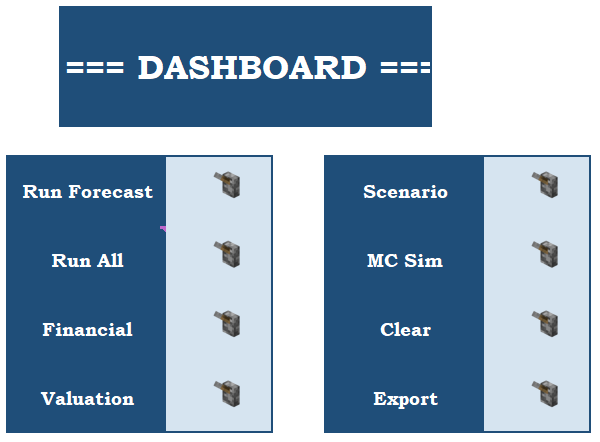
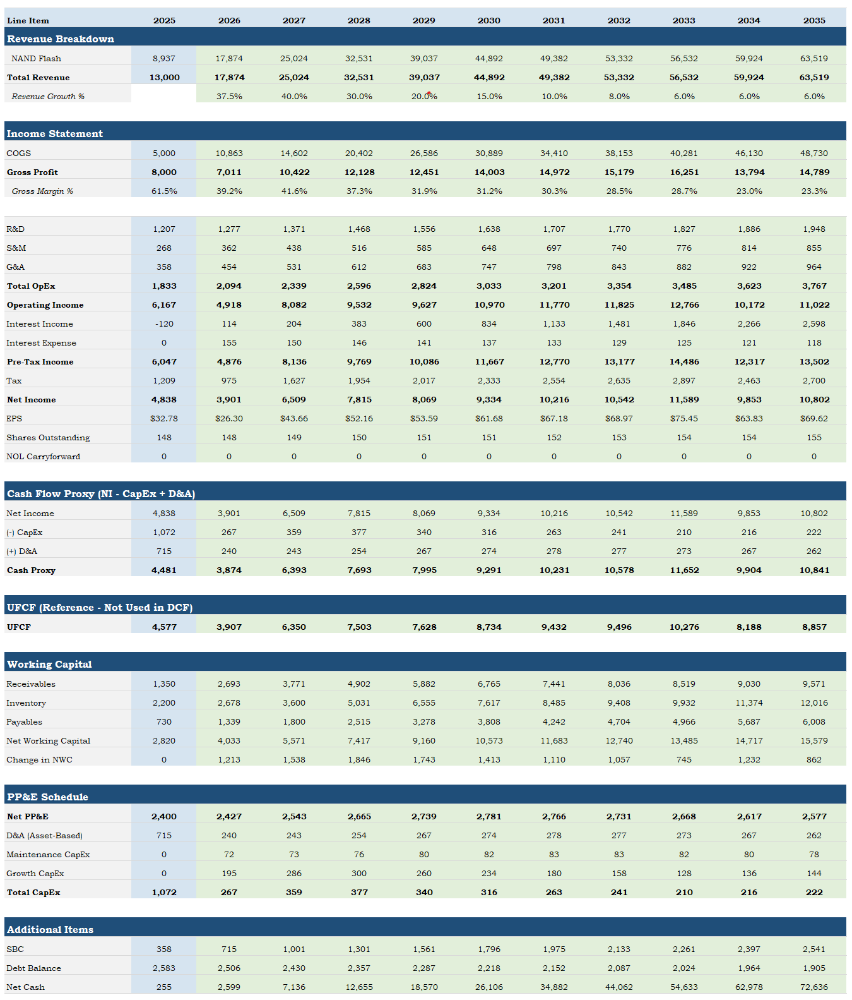
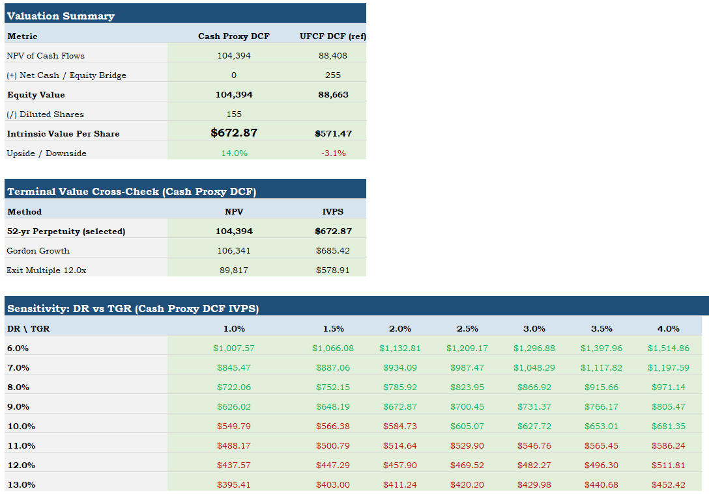
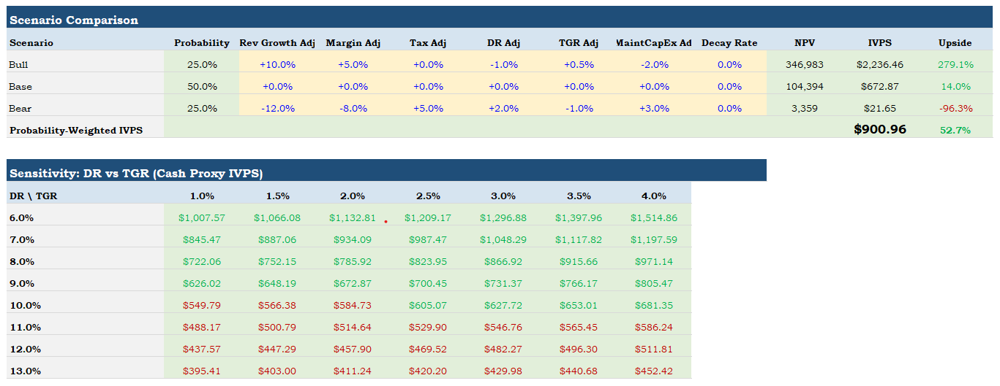
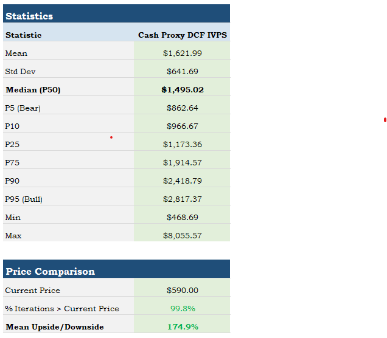
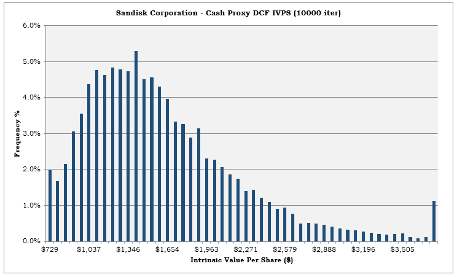

# Rishi's Equity Model

Pretty proud of this one.

I feel like it's the first consolidation of my knowledge in a very competent manner. Building and using this was such a terrific experience. It showed me a lot of valuable tools and skills and got me to really familiarise myself with the granularity that comes with fundamental financial analysis.

Agentic Engineering was utilised in error handling, cleanup, and note making.

---

## How It Works

The user populates a single Assumptions sheet with the target company's financials, valuation parameters, and uncertainty ranges. From there, macro buttons on the Dashboard drive the entire workflow.

The model adapts to different company types through binary toggles:

- Asset-heavy manufacturers get a fixed+variable cost structure with a PP&E schedule
- Asset-light businesses use simpler margin-based projections
- Multi-segment conglomerates get independent growth and gross margin curves per division
- Single-product companies use one segment

---

## Output

### Dashboard

### Projected Financials

### Valuation

### Scenario Analysis

### Monte Carlo — Output Statistics

### Monte Carlo — Histogram

---

## Case Study

Here's a company I'm interested in run through the model. Full equity research write-ups live in the [Equity Research](../equity-research/) section of this portfolio.

### SanDisk

This company came to my attention for a few reasons. *Disclosure:* I am currently short this stock. 

Its explosive share appreciation following its spin-off from Western Digital is obviously quite jarring. This got me interested in how a firm selling a commoditised product can be priced like Nvidia (10x+ in under a year). 

The analysis on this company falls hand in hand with my prior knowledge in the tech and AI space. I've saved the thorough due diligence for my Equity Research GitHub section.

**Key outputs:**

| Metric | Value |
|--------|-------|
| IVPS (Base Case) | <!-- $ --> |
| Market Price at Analysis | <!-- $ --> |
| Implied Upside/Downside | <!-- % --> |
| MC Iterations | <!-- e.g. 10,000 --> |
| MC % Above Market Price | <!-- % --> |
| Bull / Base / Bear IVPS | <!-- $ / $ / $ --> |

> **[Full Write-Up →](../equity-research/)**

---

## Core Features

### Valuation Engine

The primary valuation runs on a **Cash Proxy DCF** (Net Income − CapEx + D&A). Unlevered Free Cash Flow is computed alongside as a cross-reference.

The user can switch between the two via a toggle.

Three terminal value methods are supported:

- **Gordon Growth Model** — closed-form terminal value
- **Explicit Perpetuity** — customisable year-by-year projection
- **Exit Multiple** — EV/UFCF based terminal value

The Valuation sheet outputs an intrinsic value per share (IVPS).

### Monte Carlo Simulation

This builds on the standalone Monte Carlo Simulation Engine (Project 2 in this portfolio) but takes the concept significantly further.

Where the earlier project ran independent draws from basic distributions, this implementation adds:

- **Correlated parameter draws**
- **Revenue autocorrelation**
- **Mean-reversion dynamics**
- **Phase-based shock regimes**
- **PERT, Normal, Triangular, Uniform, and Lognormal distributions**
- **12+ variables**
- **Full output statistics**

The simulation runs configurable iterations (max 50,000) and outputs the percentage of iterations that exceed the current market price — a direct probabilistic answer to "is this stock cheap?"

### Scenario Analysis

Bull/Base/Bear Scenario. You know the deal.

### Penman Reformulated Financials

The Formulas sheet implements Stephen Penman's equity valuation framework. This guy's insights are no joke.

---

## Under the Hood

The workbook is 9 sheets with data flowing from Assumptions → Financials → Valuation → Scenarios / Monte Carlo. 

The user only touches the Assumptions sheet. Everything else is auto-generated

The codebase spans 14 modules covering the forecast engine, valuation writer, Monte Carlo simulation, scenario analysis, statistical distributions, and shared formatting. 275+ named ranges create an abstraction layer so the VBA never hardcodes cell addresses.

Eight binary toggles on the Assumptions sheet let the model adapt to different company types. Switching between WACC vs. flat discount rate, asset-heavy vs. asset-light cost structures, detailed vs. simple working capital, segment-level vs. consolidated margins, and three different terminal value methods.

---

## Tech

**Excel VBA** · Named Range Architecture (275+) · Statistical Distributions (PERT, Normal, Triangular, Uniform, Lognormal) · Monte Carlo Simulation with Cross-Correlation, Autocorrelation & Phase-Based Shock Regimes · DCF Valuation · Scenario Analysis with Year-Level Overrides · Penman Reformulated Financials · Asset-Heavy Cost Modelling · Segment-Level Revenue Projection · Design System (modFormatStyles)

---
