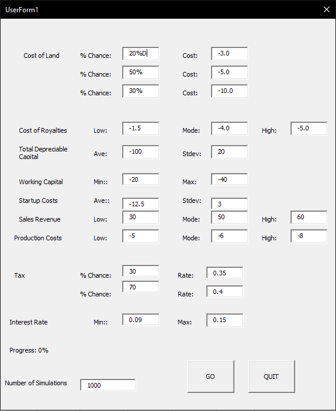
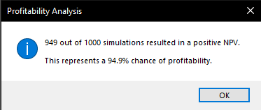
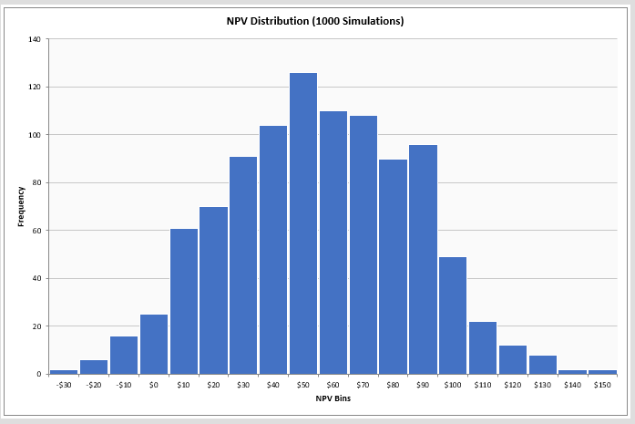

# My Project Portfolio

## Project 1: Discounted Cash Flow Model Macro
### Overview - Two Options
#### Option 1 - DCF Template
   - Utilises VBA buttons and subroutines to create an empty DCF template
   - Provides an option to state forecast period + generates an inputs area 
   - fit with dynamic cells and excel formulas 
  
##### Screenshots

#### Option 2 - Userform 
   - Allows the user to input key metrics into a userform
   - Internally computes IRR and NPV, displaying both in a message box
##### Screenshots
  

---

## Project 2: Monte Carlo Project Simulation Macro

### Overview 
- Allows the user to simulate project NPV based on the variability of key line items
  - Inputs follow either discrete, triangular or uniform distribution
- Creates a Histogram that visualises the distribution of project outcomes
##### Screenshots
  
  
   
     
