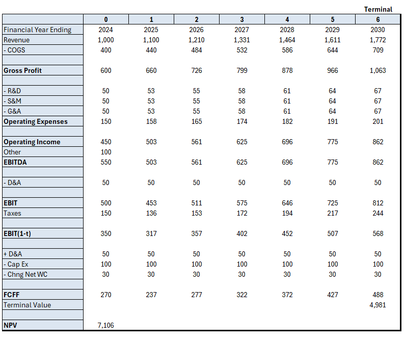

# Discounted Cash Flow Model — Excel VBA

A macro-driven DCF tool built in Excel VBA, designed to streamline the valuation workflow. It offers two distinct approaches depending on what you need.

---

## What I Learned

This was my first real VBA project. Honestly did not expect the VBA course I took in 2025 to be applicable at all, but it was honestly one of the most interesting things I've learnt. 

Just makes me love Excel even more.

---

## Option 1: DCF Template Generator

Generates a fully formatted, empty DCF template at the click of a button. You specify the forecast period and the macro builds out the entire structure. 

This includes: 
- Input areas 
- Formula-linked cells
- Dynamic formatting  
- Custom forecast period selection
- Auto-generated input areas with pre-linked formulas
- Clean, structured formatting ready for immediate use

---

## Option 2: Quick Valuation Userform

A standalone userform for rapid valuation. Plug in the key metrics directly, and the macro computes both IRR and NPV internally, displaying results in a message box. 

Useful when you need a quick answer without building a full model.

- Direct input of key financial metrics via userform
- Internal IRR and NPV computation
- Results displayed immediately via message box

---
