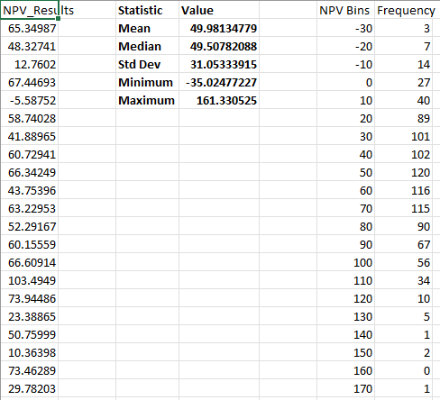

# Monte Carlo Simulation Engine — Excel VBA

A simulation tool that models the distribution of project NPV outcomes under uncertainty. Rather than relying on a single base case or a handful of scenarios, this macro runs bulk simulations across variable inputs to give you a real picture of the range of possible outcomes.

---

## How It Works

The user defines key line items and assigns each a probability distribution — discrete, triangular, or uniform — depending on the nature of the input. The macro then runs the simulation, producing a full dataset of outcomes.

- **Flexible input distributions:** Discrete, triangular, and uniform options to match different types of assumptions
- **Histogram output:** Visualises the full distribution of simulated project NPVs
- **Summary statistics:** Key metrics surfaced automatically after each run

---

## Screenshots

---

## What I Learned

This project pushed me well beyond basic VBA. Implementing statistical distributions from scratch, generating randomised simulation runs, and building histogram visualisations entirely within Excel forced me to think computationally about problems I'd previously only approached analytically. It was also the project that made me realise how powerful VBA can be when you stop treating it as a macro recorder.
